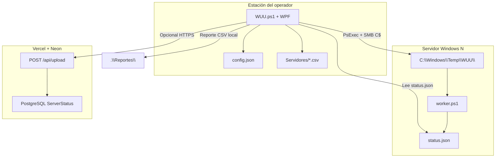
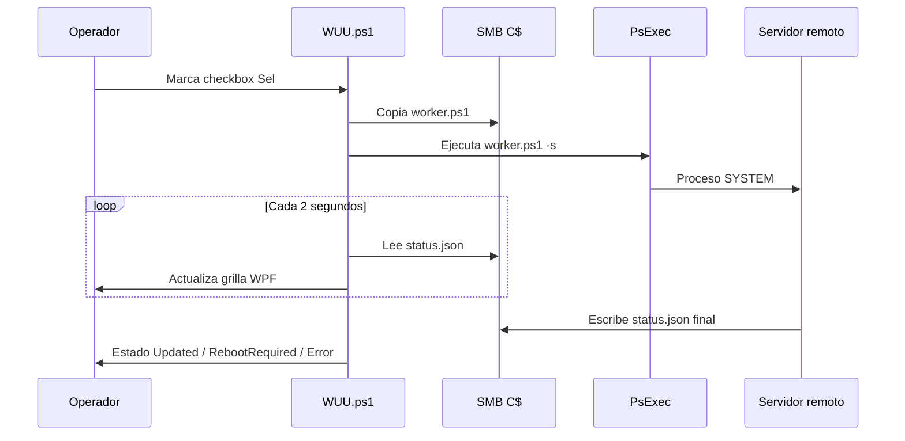

# Guía Técnica — PatchControl / WUU

**Versión del documento:** 1.0  
**Basado en:** `README.md` y código fuente de `WUU.ps1`  
**Audiencia:** operadores de infraestructura, administradores Windows, desarrolladores del dashboard  
**Producto:** PatchControl — sistema de parcheo y monitoreo de servidores Windows para entornos corporativos Algeiba

---

## Tabla de contenidos

1. [Resumen ejecutivo](#1-resumen-ejecutivo)
2. [Alcance y componentes](#2-alcance-y-componentes)
3. [Requisitos previos](#3-requisitos-previos)
4. [Arquitectura del sistema](#4-arquitectura-del-sistema)
5. [Despliegue y estructura de archivos](#5-despliegue-y-estructura-de-archivos)
6. [WUU.ps1 — Guía operativa detallada](#6-wuups1--guía-operativa-detallada)
7. [Configuración externa (`config.json`)](#7-configuración-externa-configjson)
8. [Integración con el dashboard web](#8-integración-con-el-dashboard-web)
9. [Procedimientos operativos](#9-procedimientos-operativos)
10. [Referencia de datos y protocolos](#10-referencia-de-datos-y-protocolos)
11. [Concurrencia, timers y archivos remotos](#11-concurrencia-timers-y-archivos-remotos)
12. [Logging y auditoría](#12-logging-y-auditoría)
13. [Matriz de solución de problemas](#13-matriz-de-solución-de-problemas)
14. [Apéndices](#14-apéndices)

---

## 1. Resumen ejecutivo

PatchControl centraliza el **parcheo remoto de servidores Windows** desde una estación de trabajo del operador. El núcleo es **`WUU.ps1`** (*Windows Update Utility*): una aplicación de escritorio construida con **PowerShell 5.1 + WPF** que orquesta tareas en servidores remotos mediante **PsExec** y **SMB (`C$`)**.

**Principio de diseño fundamental:** WUU **no instala parches localmente**. Copia scripts PowerShell a cada servidor remoto (`C:\Windows\Temp\WUU\`), los ejecuta como **SYSTEM** (`PsExec -s`) y lee el progreso mediante archivos **JSON** compartidos por red. El parcheo usa el agente nativo de Windows Update (`Microsoft.Update.*`) o herramientas del SO (`wusa.exe`, `dism.exe`).

Opcionalmente, los reportes de inventario/KBs se sincronizan con un **dashboard web** (Next.js 16 + PostgreSQL en Vercel) vía `POST /api/upload`.



---

## 2. Alcance y componentes

| Componente | Tecnología | Rol |
|------------|------------|-----|
| **WUU.ps1** | PowerShell 5.1 + WPF + C# embebido | Consola de parcheo, reportes, Fix, programación |
| **PsExec.exe** | Sysinternals | Ejecución remota como SYSTEM |
| **config.json** | JSON | Configuración externa sin editar el script |
| **Servidores/*.csv** | CSV (`;` o `,`) | Inventario de hosts y grupos |
| **dashboard/** | Next.js 16, Prisma, PostgreSQL | Visualización centralizada de reportes |

### Modos de ejecución de WUU

| Modo | Comando | Interfaz | Uso típico |
|------|---------|----------|------------|
| **Normal** | `WUU.ps1` | WPF completa | Parcheo interactivo del operador |
| **Headless** | `WUU.ps1 -Scheduled` | Ninguna | Tarea programada de Windows (reporte diario) |

---

## 3. Requisitos previos

### 3.1 Estación de trabajo (donde corre WUU)

| Requisito | Detalle |
|-----------|---------|
| SO | Windows 10/11 o Windows Server con escritorio |
| Privilegios | **Administrador local** (UAC elevado al iniciar) |
| PowerShell | 5.1 o superior |
| ExecutionPolicy | `Bypass` en la línea de comando (recomendado) |
| Red | Acceso SMB (puerto **445**) y PsExec a servidores destino |
| Archivos | `WUU.ps1`, `PsExec.exe`, `config.json` en la misma carpeta |

### 3.2 Servidores remotos

| Requisito | Detalle |
|-----------|---------|
| SO | Windows Server (2012 R2 en adelante, según compatibilidad WU) |
| Recurso admin | `\\SERVIDOR\C$` accesible con credenciales del operador |
| PsExec | Aceptación de EULA (`-accepteula`) |
| Espacio en C: | Mínimo **2 GB** libres para ciclo WU completo |
| Servicios | Windows Update / BITS operativos (o remediación automática) |

### 3.3 Dashboard (opcional)

| Requisito | Detalle |
|-----------|---------|
| URL de producción | `https://algeibapatching.vercel.app/api/upload` |
| Variables | `DATABASE_URL`, `NEXTAUTH_SECRET` en Vercel |
| Acceso desde WUU | HTTPS saliente (TLS 1.2) hacia Vercel |

### 3.4 Comando de arranque recomendado

```powershell
powershell.exe -NoProfile -ExecutionPolicy Bypass -File ".\WUU.ps1"
```

Modo programado:

```powershell
powershell.exe -NoProfile -ExecutionPolicy Bypass -WindowStyle Hidden -File ".\WUU.ps1" -Scheduled
```

---

## 4. Arquitectura del sistema

### 4.1 Vista lógica

```
┌─────────────────────────────────────────────────────────────────────────┐
│  ESTACIÓN DEL OPERADOR                                                  │
│                                                                         │
│  WUU.ps1                                                                │
│    ├─ Load-Config          → config.json                                │
│    ├─ Load-Csv             → Servidores\*.csv                           │
│    ├─ UI WPF               → grilla en vivo, botones, menú contextual   │
│    ├─ Runspaces paralelos  → PsExec por servidor                        │
│    ├─ Reportes\            → CSV por corrida                            │
│    ├─ Historial\           → acumulado CSV + JSON                       │
│    ├─ Logs\                → log por sesión                             │
│    └─ [Opcional] POST      → Vercel /api/upload                         │
└─────────────────────────────────────────────────────────────────────────┘
                                    │
                                    ▼
┌─────────────────────────────────────────────────────────────────────────┐
│  DASHBOARD (Vercel + Neon PostgreSQL)                                   │
│  /  /historial  /reportes  /login  /usuarios                          │
└─────────────────────────────────────────────────────────────────────────┘
```

### 4.2 Flujo de parcheo (alto nivel)



### 4.3 Separación de responsabilidades

| Capa | Responsabilidad |
|------|-----------------|
| **UI (WPF)** | Selección de servidores, visualización, confirmaciones |
| **Orquestador (WUU)** | Runspaces, timers, copia de scripts, lectura JSON |
| **Trabajador remoto** | Windows Update, Fix, reportes, verificación |
| **Dashboard** | Persistencia y visualización histórica |

---

## 5. Despliegue y estructura de archivos

### 5.1 Layout del repositorio / carpeta operativa

```
PatchControl/
├── WUU.ps1                 # Script principal (~2.100 líneas)
├── config.json             # Configuración externa
├── PsExec.exe              # Sysinternals (NO incluido en repo)
│
├── Servidores/             # Inventario CSV (uno o más archivos)
│   └── servidores.csv
├── Fix/                    # Paquetes .msu / .cab (opcional)
├── Reportes/               # CSV generados por cada reporte
├── Historial/              # Historial acumulado
│   ├── Resumen_YYYY-MM.csv
│   └── Detail/*.json
├── Logs/                   # Un log por sesión WUU
│
└── dashboard/              # App Next.js (despliegue separado en Vercel)
    ├── prisma/schema.prisma
    └── src/app/api/upload/route.ts
```

### 5.2 Carpetas creadas automáticamente

WUU crea `Reportes\`, `Historial\`, `Logs\` si no existen. En servidores remotos crea `C:\Windows\Temp\WUU\` al iniciar un job.

---

## 6. WUU.ps1 — Guía operativa detallada

### 6.1 Secuencia de arranque

Al ejecutar `WUU.ps1` (modo normal):

1. **Auto-elevación:** si no hay privilegios de administrador, relanza con `-Verb runas` (UAC). Si el usuario cancela, termina sin UI.
2. **Ensamblados WPF:** `PresentationFramework`, `PresentationCore`, `WindowsBase`, `System.Xaml`.
3. **Clases C# embebidas** (`Add-Type`): `ServerRow`, `GroupItem`, `ReportRow`, etc. con `INotifyPropertyChanged`.
4. **Parseo XAML** embebido y referencias a controles.
5. **Logging:** crea `Logs\WUU_YYYY-MM-DD_HH-mm-ss.log`.
6. **`Load-Config`:** lee o genera `config.json`.
7. **Scripts trabajadores** en `%TEMP%`: `WUU_worker.ps1`, `WUU_report.ps1`, etc.
8. **`Load-Csv`:** carga inventario desde `Servidores\`.
9. **`$Window.ShowDialog()`:** muestra la interfaz.

Modo `-Scheduled`: omite la UI y ejecuta el flujo headless de reporte (sección 6.8).

### 6.2 Interfaz gráfica (WPF)

#### 6.2.1 Zona superior — búsqueda y grupos

| Elemento | Comportamiento |
|----------|----------------|
| **Buscar** | Autocompletado por nombre o IP; agrega servidores del CSV sin seleccionar todo el grupo |
| **Seleccionar grupos** | Popup con checkboxes por valor único de columna `Grupo` |
| **Debounce 1,5 s** | Tras estabilizar la selección, escribe en log: `Sesion iniciada. Grupos: ...` |
| **Contador** | `Servidores cargados: N \| Seleccionados: M` |

#### 6.2.2 Leyenda de colores (`State`)

| Color | `State` | Significado |
|-------|---------|-------------|
| Gris claro | `Unselected` | Sin proceso activo |
| Khaki | `CheckWSUS` | Chequeo WSUS / Windows Update |
| Naranja | `Remediation` | Remediación del agente WU |
| Celeste | `DownloadInstall` | Descarga o instalación |
| Rojo parpadeante | `RebootRequired` | Reinicio pendiente |
| Verde claro | `Updated` | Completado sin pendientes |

#### 6.2.3 Columnas de la grilla principal

| Columna UI | Propiedad | Origen |
|------------|-----------|--------|
| Sel | `Sel` | Checkbox; al marcar → inicia parcheo |
| Servidor | `Servidor` | CSV |
| IP | `IP` | CSV + actualización en vivo desde `status.json` |
| Servidor WSUS | `Wsus` | Registro `WUServer` o "No configurado (WU directo)" |
| Available | `Available` | Updates pendientes |
| Downloaded | `Downloaded` | Contador de descargados |
| Download % | `DownloadPct` | Porcentaje 0–100 |
| Error | `Error` | Mensaje del trabajador remoto |
| Status | `Status` | Texto descriptivo de etapa |
| Running Time | `RunningTime` | Cronómetro `hh:mm:ss` local |

Campos CSV no visibles en grilla pero usados en reportes: `Grupo`, `Dominio`, `OS`, `Ambiente`.

#### 6.2.4 Botones inferiores

| Botón | Función |
|-------|---------|
| **Limpiar selección** | Desmarca `Sel`, resetea estado visual. No detiene jobs activos. |
| **Reporte** | `Show-Report`: consulta paralela de todos los servidores visibles |
| **Recargar grupos** | Detiene jobs, desmarca grupos, vacía grilla |
| **Fix** | Instala `.msu`/`.cab` de `Fix\` en servidores elegidos |
| **Programar** | Gestiona tarea programada de Windows (`-Scheduled`) |
| **Detener y refrescar** | Escribe `stop.flag`, cierra runspaces, cancela monitores y auto-reinicios |

### 6.3 Inventario CSV

#### Función `Load-Csv`

1. Busca `Servidores\` junto a `WUU.ps1`.
2. Importa **todos** los `.csv` y los fusiona.
3. Detecta delimitador: `;` si la primera línea contiene `;` y no `,`; si no, `,`.
4. Valida columnas obligatorias: **`Grupo`**, **`Servidor`**.
5. Construye lista de grupos únicos ordenados alfabéticamente.

#### Función `Rebuild-Grid`

1. Filtra filas cuyo `Grupo` está marcado.
2. **Deduplica por `Servidor`** (primera ocurrencia).
3. Crea objetos `ServerRow` con handler `PropertyChanged` en `Sel`.

#### Esquema del CSV

| Columna | Obligatoria | Uso |
|---------|-------------|-----|
| `Grupo` | Sí | Agrupación en selector |
| `Servidor` | Sí | Hostname DNS para PsExec/SMB |
| `Dominio` | No | Reporte y dashboard |
| `IP` | No | Referencia; puede completarse en vivo |
| `OS` | No | Referencia de inventario |
| `Ambiente` | No | Producción, Desarrollo, Test, etc. |

**Ejemplo (locale es-AR, delimitador `;`):**

```csv
Grupo;Dominio;IP;OS;Servidor;Ambiente
Producción1;petersen.corp;10.50.89.98;Windows Server 2019 Standard;BERENROLLWEB02P;Producción
```

### 6.4 Motor de parcheo (Windows Update)

#### Disparo

Marcar **Sel** → `On-ServerSelChanged` → `Start-ServerJob`:

1. Evita jobs duplicados por servidor.
2. Verifica `PsExec.exe`.
3. Resetea columnas y arranca cronómetro.
4. Runspace en background:
   - Crea `\\SERVIDOR\C$\Windows\Temp\WUU\`
   - Elimina `status.json` y `stop.flag` previos
   - Copia `WUU_worker.ps1` → `worker.ps1`
   - Ejecuta:

```text
PsExec \\SERVIDOR -accepteula -nobanner -s powershell.exe -ExecutionPolicy Bypass -NonInteractive -File C:\Windows\Temp\WUU\worker.ps1
```

`-s` = cuenta **SYSTEM** en el remoto. Autenticación de red = credenciales del operador que abrió WUU.

#### Refresco en vivo — `On-TimerTick` (cada 2 s)

1. Lee `status.json` por SMB.
2. `Apply-Status` mapea `stage` → color de fila.
3. Actualiza columnas de progreso y `RunningTime`.
4. Al terminar PsExec (`sync.done`), libera recursos y escribe log.
5. Si todos los jobs finalizaron → `Save-History` tipo `Parcheo`.

#### Flujo remoto `worker.ps1`

```
INICIO
  ├─ IP + WSUS (HKLM\...\WindowsUpdate\WUServer)
  ├─ CHEQUEO: Microsoft.Update.Session → Search("IsInstalled=0 and IsHidden=0")
  │     ├─ Error → REMEDIACIÓN (wuauserv, SoftwareDistribution, gpupdate)
  │     ├─ 0 updates → done | reboot
  │     └─ N updates → verificar 2 GB libres en C:
  │           ├─ DESCARGA update por update (% en vivo)
  │           └─ INSTALACIÓN CreateUpdateInstaller → Install()
  └─ En puntos seguros: stop.flag → stopped
```

#### Esquema `status.json`

| Campo | Tipo | Valores / descripción |
|-------|------|------------------------|
| `stage` | string | `check`, `remediate`, `download`, `install`, `reboot`, `done`, `stopped`, `error` |
| `wsus` | string | URL WSUS o "No configurado (WU directo)" |
| `ip` | string | IPv4 detectada |
| `available` | int | Updates pendientes |
| `downloaded` | int | Descargados |
| `downloadPct` | int | 0–100 |
| `error` | string | Mensaje de error |
| `status` | string | Texto para columna Status |
| `rebootRequired` | bool | Reinicio necesario |

Escritura **atómica:** `status.json.tmp` → `Move-Item` → `status.json`.

#### Detención segura — `Stop-ServerJob`

1. Escribe `stop.flag` en el servidor remoto.
2. El worker aborta **entre etapas** (no interrumpe instalación a mitad).
3. Detiene runspace local.
4. Con `-Reset`, fila vuelve a `Unselected`.

### 6.5 Instalación Fix (.msu / .cab)

Flujo independiente del ciclo WU.

| Paso | Acción |
|------|--------|
| 1 | Verificar `Fix\` con al menos un `.msu` o `.cab` |
| 2 | Elegir archivo (si hay varios) |
| 3 | Elegir servidores destino |
| 4 | Confirmación del operador |
| 5 | `Start-FixJob` por servidor |

**Instalación remota (`fix.ps1`):**

| Extensión | Comando |
|-----------|---------|
| `.msu` | `wusa.exe "archivo" /quiet /norestart` |
| `.cab` | `dism.exe /online /add-package /packagepath:"archivo" /quiet /norestart` |

**Códigos de salida:**

| Código | Significado |
|--------|-------------|
| `0` | Instalado |
| `3010` | Instalado, requiere reinicio |
| `2359302` | Ya estaba instalado |
| `-2145124329` | No aplicable |
| Otro | Error |

Resultado en `fix.json`.

### 6.6 Reporte de parcheo

#### Disparo — botón **Reporte**

| Parámetro | Valor |
|-----------|-------|
| Alcance | Todos los servidores visibles en grilla |
| Paralelismo | Un runspace por servidor |
| Timeout global | 10 minutos |
| Progreso UI | Botón muestra `Generando N/Total...` |

#### Por servidor

1. Copia `WUU_report.ps1` → remoto `report.ps1`
2. PsExec como SYSTEM
3. Lee `report.json`
4. Fallback si falla: `Descripcion_Error = "Sin conexion o sin datos"`

#### Campos recolectados (`report.ps1`)

| Campo | Origen |
|-------|--------|
| `Dominio` | `Win32_ComputerSystem.Domain` |
| `Servidor` | `Dns.GetHostName()` |
| `IP` | Primera IPv4 ≠ 127.x / 169.254.x |
| `Sistema_Operativo` | `Win32_OperatingSystem.Caption` |
| `Version_Sistema_Operativo` | Versión de `netlogon.dll` |
| `Fecha_Instalacion` | Lógica KBs (mes en curso) |
| `KBs_Instaladas` | Lógica KBs (mes en curso) |
| `Fecha_Reinicio` | `LastBootUpTime` |
| `Running_Time` | Uptime desde último boot |
| `Descripcion_Error` | Primer evento Error de `Microsoft-Windows-WindowsUpdateClient` |

#### Lógica de KBs (mes en curso)

| Condición | `KBs_Instaladas` | `Fecha_Instalacion` |
|-----------|------------------|---------------------|
| Hay hotfixes del mes actual | Lista `HotFixID` separados por coma | Fecha del más reciente del mes |
| No hay hotfixes este mes | Vacío | Fecha del último hotfix histórico |

#### Finalización — `On-ReportTick`

1. Deduplica por `Servidor`
2. Orden alfabético → objetos `ReportRow`
3. `Save-ReportCsv` → `Reportes\Reporte_YYYY-MM-DD_HH-mm-ss.csv` (delimitador `;`, UTF-8)
4. `Show-ReportWindow` → grilla modal + sincronización Vercel en background
5. `Save-History` tipo `ReporteManual`

### 6.7 Sincronización con Vercel

Controlada por `config.json → Dashboard`:

```json
"Dashboard": {
  "Enabled": true,
  "Url": "https://algeibapatching.vercel.app/api/upload"
}
```

| `Dashboard.Enabled` | Comportamiento |
|---------------------|----------------|
| `false` | Solo reporte local; mensaje en ventana de reporte |
| `true` | POST al abrir reporte, reintentar, y en `-Scheduled` |

**`Sync-ToVercel` — pasos:**

1. Verifica flags y URL
2. Construye array con 10 propiedades del reporte
3. **Deduplica por `Servidor`**
4. `ConvertTo-Json -Depth 5` (PowerShell 5.1: envuelve array si hay 1 solo elemento)
5. `Invoke-WebRequest` POST, timeout 120 s, TLS 1.2
6. Muestra `result.count` o detalle de error del API

### 6.8 Reporte programado (modo headless)

**Comando:**

```powershell
powershell.exe -NoProfile -ExecutionPolicy Bypass -WindowStyle Hidden -File ".\WUU.ps1" -Scheduled
```

**Flujo:**

1. Carga `config.json`
2. Consulta **todos** los servidores del CSV (todos los grupos)
3. Guarda CSV en `Reportes\`
4. Sincroniza Vercel si `Dashboard.Enabled = true`
5. `Save-History` tipo `ReporteProgramado` si `History.Enabled = true`
6. Log + `exit 0`

**Creación desde UI:** botón **Programar** → registra tarea en Programador de Windows → persiste `ScheduledReport` en `config.json`.

### 6.9 Historial acumulado

Con `History.Enabled = true`:

```
Historial/
├── Resumen_YYYY-MM.csv
└── Detail/
    └── YYYY-MM-DD_HH-mm-ss_Tipo.json
```

`RetentionDays` controla limpieza automática de archivos antiguos.

### 6.10 Auto-reinicio tras parcheo

Con `AutoReboot.Enabled = true` y etapa final `reboot`:

1. Espera `AutoReboot.DelaySeconds` (default 60 s)
2. Ejecuta `shutdown /r /t 10` vía PsExec
3. Cancelable desde menú contextual (**Reiniciar servidor** cancela countdown)

### 6.11 Menú contextual y post-reinicio

| Opción | Script remoto | JSON |
|--------|---------------|------|
| Reiniciar servidor | — | — (+ monitoreo SMB) |
| Check for Updates | `worker.ps1` | `status.json` |
| Ver historial de updates | `history.ps1` | `history.json` |
| Log WU | `wulog.ps1` | `wulog.json` |

**Monitoreo post-reinicio (`Start-RebootMonitor`):**

| Fase | Duración | Acción |
|------|----------|--------|
| A | hasta 4 min | Esperar que SMB (445) deje de responder |
| B | hasta 20 min | Esperar que SMB vuelva |
| Pausa | 25 s | Margen para servicios del SO |
| C | — | Ejecutar `verify.ps1`, leer `verify.json` |

`verify.ps1` solo consulta; no instala updates.

---

## 7. Configuración externa (`config.json`)

WUU lee **únicamente** `config.json` en la carpeta del script. Si no existe, lo crea al primer arranque.

### 7.1 Archivo de referencia completo

```json
{
  "PsExecPath": "",
  "RemoteRel": "Windows\\Temp\\WUU",
  "PatchTimeoutMinutes": 90,
  "ConnectivityTimeoutSec": 3,
  "CleanupRemoteOnSuccess": true,
  "Dashboard": {
    "Enabled": true,
    "Url": "https://algeibapatching.vercel.app/api/upload"
  },
  "ScheduledReport": {
    "Enabled": false,
    "Hour": 8,
    "Minute": 0,
    "TaskName": "WUU_ReporteAutomatico"
  },
  "History": {
    "Enabled": true,
    "RetentionDays": 90
  },
  "AutoReboot": {
    "Enabled": true,
    "DelaySeconds": 60
  }
}
```

### 7.2 Referencia de campos

| Sección / campo | Tipo | Default | Descripción |
|-----------------|------|---------|-------------|
| `PsExecPath` | string | `""` | Ruta a PsExec; vacío = junto a WUU.ps1 |
| `RemoteRel` | string | `Windows\Temp\WUU` | Ruta relativa a `C:\` en remotos |
| `PatchTimeoutMinutes` | int | 90 | Timeout por job de parcheo |
| `ConnectivityTimeoutSec` | int | 3 | Timeout test SMB inicial |
| `CleanupRemoteOnSuccess` | bool | true | Limpiar archivos remotos tras éxito |
| `Dashboard.Enabled` | bool | true | Sincronización Vercel |
| `Dashboard.Url` | string | URL producción | Endpoint POST |
| `ScheduledReport.Enabled` | bool | false | Flag de tarea programada |
| `ScheduledReport.Hour` | int | 8 | Hora diaria (0–23) |
| `ScheduledReport.Minute` | int | 0 | Minuto (0–59) |
| `ScheduledReport.TaskName` | string | WUU_ReporteAutomatico | Nombre en Task Scheduler |
| `History.Enabled` | bool | true | Acumular en Historial\ |
| `History.RetentionDays` | int | 90 | Retención de archivos |
| `AutoReboot.Enabled` | bool | true | Reinicio automático post-parcheo |
| `AutoReboot.DelaySeconds` | int | 60 | Espera antes del shutdown |

> **Nota:** WUU no lee archivos alternativos (`config1.json`, etc.). Solo `config.json`.

---

## 8. Integración con el dashboard web

### 8.1 Stack

| Capa | Tecnología |
|------|------------|
| Frontend / API | Next.js 16 |
| ORM | Prisma |
| Base de datos | PostgreSQL (Neon) |
| Hosting | Vercel |
| URL producción | `https://algeibapatching.vercel.app` |

### 8.2 Rutas

| Ruta | Descripción | Auth |
|------|-------------|------|
| `/` | Dashboard: métricas, gráfico, tabla con búsqueda | Sí |
| `/historial` | Historial de sincronizaciones (`SyncRun`) | Sí |
| `/reportes` | Estadísticas de parcheo | Sí |
| `/usuarios` | Gestión de usuarios (admin) | Sí |
| `/login` | Autenticación por credenciales | No |
| `/api/upload` | Recepción de reportes desde WUU | **No** (público) |

### 8.3 Contrato API — `POST /api/upload`

**Request:** array JSON de servidores (también acepta `{ "servers": [...] }`).

```json
[
  {
    "Dominio": "petersen.corp",
    "Servidor": "BERENROLLWEB02P",
    "IP": "10.50.89.98",
    "Sistema_Operativo": "Microsoft Windows Server 2019 Standard",
    "Version_Sistema_Operativo": "10.0.17763.5458",
    "Fecha_Instalacion": "2026-06-17",
    "KBs_Instaladas": "KB5034441, KB5036896",
    "Fecha_Reinicio": "2026-06-17 08:30:00",
    "Running_Time": "06:08:12",
    "Descripcion_Error": ""
  }
]
```

**Comportamiento del API:**

- Deduplica por `Servidor` antes del upsert
- Persiste en tabla `ServerStatus` (clave única: `serverName`)
- Puede registrar `syncRunId` de historial

**Response exitoso (ejemplo):** incluye `count` con cantidad de servidores procesados.

### 8.4 Autenticación del dashboard

Middleware en `src/proxy.ts` redirige a `/login` excepto rutas públicas (`/api/upload`, `/api/auth`, assets estáticos).

**Variables de entorno:**

```env
DATABASE_URL=postgresql://...
NEXTAUTH_SECRET=clave-secreta-segura
```

**Usuario admin inicial:**

```bash
cd dashboard
npx tsx scripts/seed-admin.ts
```

### 8.5 Desarrollo local del dashboard

```bash
cd dashboard
npm install
npx prisma generate
npx prisma db push
npx tsx scripts/seed-admin.ts
npm run dev
```

---

## 9. Procedimientos operativos

### 9.1 Parcheo interactivo (runbook)

| Paso | Acción | Verificación |
|------|--------|--------------|
| 1 | Ejecutar WUU como administrador | Ventana WPF visible |
| 2 | Revisar `Logs\` si hay errores de config | Línea `config.json cargado` |
| 3 | Seleccionar grupos o buscar servidores | Contador de servidores > 0 |
| 4 | Marcar **Sel** en servidores a parchear | Columna Status cambia |
| 5 | Monitorear colores y % descarga | `status.json` actualizándose |
| 6 | Ante `RebootRequired` | Reinicio manual, auto-reboot o menú contextual |
| 7 | Revisar log al finalizar | Entradas `Fin SERVIDOR` |

### 9.2 Generar reporte manual

| Paso | Acción | Resultado |
|------|--------|-----------|
| 1 | Cargar servidores en grilla | — |
| 2 | Clic **Reporte** | Botón muestra progreso |
| 3 | Esperar ventana modal | CSV en `Reportes\` |
| 4 | Verificar sincronización Vercel | Label verde o mensaje de error |
| 5 | Reintentar si falla | Botón **Reintentar sincronización** |

### 9.3 Configurar reporte diario automático

| Paso | Acción |
|------|--------|
| 1 | Editar `config.json` → `Dashboard.Enabled = true` si se desea sync web |
| 2 | Abrir WUU → **Programar** |
| 3 | Definir hora y nombre de tarea → **Crear / Actualizar tarea** |
| 4 | Verificar en Programador de tareas de Windows |
| 5 | Al día siguiente, revisar `Logs\` y `Reportes\` |

### 9.4 Instalar Fix puntual

| Paso | Acción |
|------|--------|
| 1 | Colocar `.msu` o `.cab` en `Fix\` |
| 2 | Cargar servidores destino en grilla |
| 3 | Clic **Fix** → elegir paquete y servidores |
| 4 | Confirmar → monitorear hasta finalización |

---

## 10. Referencia de datos y protocolos

### 10.1 Archivos remotos (`C:\Windows\Temp\WUU\`)

| Archivo | Generado por | Propósito |
|---------|--------------|-----------|
| `worker.ps1` | WUU | Ciclo Windows Update |
| `status.json` | worker | Progreso en vivo |
| `stop.flag` | WUU | Señal de aborto |
| `report.ps1` / `report.json` | Reporte | Inventario/KBs |
| `history.ps1` / `history.json` | Menú contextual | Historial WU |
| `wulog.ps1` / `wulog.json` | Menú contextual | Eventos WU |
| `verify.ps1` / `verify.json` | Post-reinicio | Verificación |
| `fix.ps1` / `fix.json` | Fix | Instalación MSU/CAB |
| `*.msu` / `*.cab` | WUU (copiado) | Paquete a instalar |

### 10.2 Archivos locales temporales (`%TEMP%`)

| Archivo | Contenido |
|---------|-----------|
| `WUU_worker.ps1` | Script de parcheo |
| `WUU_report.ps1` | Script de reporte |
| `WUU_history.ps1` | Script historial WU |
| `WUU_wulog.ps1` | Script log WU |
| `WUU_verify.ps1` | Verificación post-reinicio |
| `WUU_fix.ps1` | Instalador Fix |

Regenerados en cada arranque de WUU desde here-strings embebidos.

### 10.3 Clases C# embebidas

| Clase | Uso |
|-------|-----|
| `ServerRow` | Fila grilla principal (`INotifyPropertyChanged`) |
| `GroupItem` | Checkbox de grupo |
| `ReportRow` | Fila ventana de reporte |
| `HistoryRow` | Historial WU (menú contextual) |
| `WuLogRow` | Log WU (menú contextual) |
| `SearchResultItem` | Resultados de búsqueda |

### 10.4 Protocolos de red utilizados

| Protocolo | Puerto | Uso |
|-----------|--------|-----|
| SMB | 445 | Acceso `C$`, lectura/escritura JSON |
| PsExec | RPC dinámico | Ejecución remota |
| HTTPS | 443 | Sincronización Vercel |

---

## 11. Concurrencia, timers y archivos remotos

### 11.1 Modelo de concurrencia

- **Runspaces** PowerShell (`runspacefactory::CreateRunspace`) con `[hashtable]::Synchronized`
- **UI WPF** en hilo principal
- **Timers** (`DispatcherTimer`) para refresco sin bloquear

### 11.2 Timers del sistema

| Timer | Intervalo | Handler | Función |
|-------|-----------|---------|---------|
| `$script:Timer` | 2 s | `On-TimerTick` | Jobs de parcheo |
| `$script:RepTimer` | 400 ms | `On-ReportTick` | Progreso reporte |
| `$script:RebootTimer` | 3 s | `On-RebootTick` | Monitoreo post-reinicio |
| `$script:FixTimer` | 700 ms | `On-FixTick` | Jobs Fix |
| `$script:GroupSelTimer` | 1,5 s | `On-GroupSelTick` | Log inicio de sesión |
| `$script:AutoRebootTimer` | 1 s | `On-AutoRebootTick` | Countdown auto-reinicio |

### 11.3 Ruta remota configurable

Default: `RemoteRel = "Windows\Temp\WUU"` → `C:\Windows\Temp\WUU\`  
Acceso SMB: `\\NOMBRE_SERVIDOR\C$\Windows\Temp\WUU\`

---

## 12. Logging y auditoría

### 12.1 Formato

```
[YYYY-MM-DD HH:mm:ss] [LEVEL] mensaje
```

### 12.2 Niveles

| Nivel | Uso |
|-------|-----|
| `INFO` | Inicio, jobs, fin de procesos, sync Vercel, sesiones |
| `WARN` | Config incompleta, situaciones recuperables |
| `ERROR` | Fallos de conexión, timeout, excepciones |

### 12.3 Ubicación

`Logs\WUU_YYYY-MM-DD_HH-mm-ss.log` — **un archivo por sesión**.

### 12.4 Eventos registrados

- Carga de `config.json`
- Inicio de sesión (grupos seleccionados)
- Jobs de parcheo, reinicio, reporte, Fix
- Sincronización Vercel (headless e interactivo)
- Timeouts y errores PsExec
- Excepciones no controladas (handler `Dispatcher.UnhandledException`)

---

## 13. Matriz de solución de problemas

| Síntoma | Causa probable | Acción |
|---------|----------------|--------|
| WUU no abre ventana | UAC cancelado o sin admin | Ejecutar como administrador |
| "Sincronizacion con Vercel suspendida" | `Dashboard.Enabled = false` | Cambiar a `true` en config.json |
| `Sync-ToVercel` no reconocido | WUU.ps1 incompleto | Verificar función ~línea 1119; actualizar script |
| Error 400 al sincronizar | Payload incorrecto (objeto envoltorio) | Actualizar WUU; debe enviar **array** |
| Error 500 al sincronizar | Servidores duplicados en batch | WUU deduplica; revisar mensaje API |
| PsExec exit ≠ 0 | SMB/firewall/credenciales/C$ | Verificar conectividad 445 y permisos |
| "Sin conexion o sin datos" en reporte | PsExec o report.json falló | Revisar log y acceso remoto |
| KBs vacías en reporte | Sin parches en mes en curso | Normal; Fecha = último hotfix histórico |
| Servidor duplicado en grilla | CSV con filas repetidas | WUU deduplica; limpiar inventario |
| Timeout 90 min | Parcheo muy lento o colgado | Revisar servidor; ajustar `PatchTimeoutMinutes` |
| Auto-reinicio no deseado | `AutoReboot.Enabled = true` | Desactivar en config o cancelar desde menú |

---

## 14. Apéndices

### Apéndice A — Checklist de despliegue inicial

- [ ] `WUU.ps1` + `PsExec.exe` + `config.json` en misma carpeta
- [ ] Carpeta `Servidores\` con CSV válido (`Grupo`, `Servidor`)
- [ ] Operador con permisos admin en estación y remotos
- [ ] Firewall permite SMB (445) estación → servidores
- [ ] `Dashboard.Enabled` configurado según necesidad
- [ ] (Opcional) Tarea programada vía botón **Programar**
- [ ] (Opcional) Dashboard: `seed-admin.ts` ejecutado en Vercel/local

### Apéndice B — Mapa de funciones principales (WUU.ps1)

| Función | Responsabilidad |
|---------|-----------------|
| `Load-Config` | Lee `config.json` |
| `Load-Csv` / `Rebuild-Grid` | Inventario y grilla |
| `Start-ServerJob` / `On-TimerTick` | Parcheo |
| `Stop-ServerJob` | Detención segura |
| `Show-Report` / `On-ReportTick` | Reporte |
| `Sync-ToVercel` | Upload dashboard |
| `Save-ReportCsv` / `Save-History` | Persistencia local |
| `Start-FixFlow` / `On-FixTick` | Fix MSU/CAB |
| `Start-RebootMonitor` | Post-reinicio |
| `Show-SchedulerWindow` | Tarea programada |
| `Write-Log` | Auditoría |

### Apéndice C — Herramientas de terceros

| Herramienta | Proveedor | Uso en PatchControl |
|-------------|-----------|---------------------|
| PsExec | Sysinternals / Microsoft | Ejecución remota |
| WUU | Algeiba (interno) | Orquestación |
| Next.js | Vercel | Dashboard |
| Prisma | Prisma Inc. | ORM |
| Recharts | Open source | Gráficos dashboard |

### Apéndice D — Documentos relacionados

| Documento | Contenido |
|-----------|-----------|
| `README.md` | Referencia rápida del repositorio |
| `GUIA_TECNICA.md` | Este documento — guía técnica extendida |
| `dashboard/README.md` | Documentación específica del frontend |

---

*Documento generado para el equipo de infraestructura Algeiba. Para actualizaciones del producto, sincronizar con `README.md` y el código fuente de `WUU.ps1`.*
